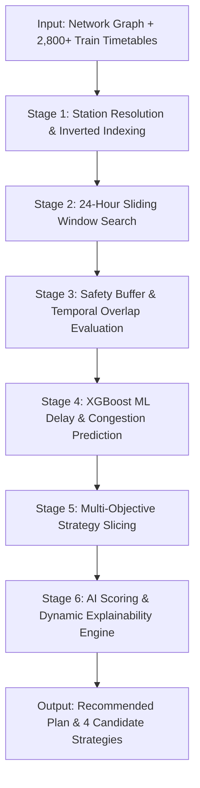
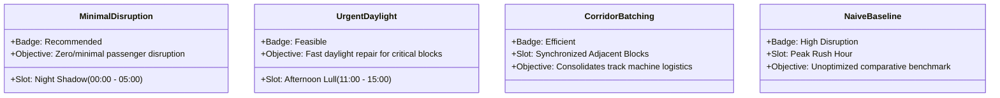

# Track Maintenance Scheduling & Optimization Algorithm Specification

This document provides the complete mathematical formulation, algorithmic architecture, and implementation details of the **RailOpt AI Optimization Engine** used for determining optimal maintenance windows on Indian Railways track corridors.

---

## 1. Problem Definition & Mathematical Formulation

### 1.1 Objective
Given a railway network graph $G = (V, E)$, a schedule of active train services $\mathcal{T} = \{T_1, T_2, \dots, T_N\}$, and a set of requested maintenance blocks $\mathcal{M} = \{M_1, M_2, \dots, M_K\}$, determine an optimal start time $t^*_k \in [0, 24\text{h}]$ for each maintenance request $M_k$ that minimizes total passenger disruption, avoids cascading delays, and respects operational safety constraints.

### 1.2 Mathematical Formulation

For each maintenance block $M_k$ on track segment $e \in E$ with duration $D_k$:

$$\min_{t_k \in \mathcal{H}} \mathcal{J}(t_k) = \alpha \sum_{i \in \mathcal{C}(t_k)} \left( w_i \cdot (\Delta_{i}(t_k) + 20) \right) + \beta \cdot \text{ML\_Delay}(t_k, D_k, \rho_e) + \gamma \cdot \mathcal{P}_{\text{priority}}(t_k) - \delta \cdot \text{NightShadowBonus}(t_k)$$

Where:
- $\mathcal{H} = \{00:00, 01:00, \dots, 23:00\}$ is the discretized 24-hour candidate window space.
- $\mathcal{C}(t_k)$ is the set of conflicting train crossings intersecting the maintenance window $[t_k - \tau_{\text{buf}}, t_k + D_k + \tau_{\text{buf}}]$.
- $\tau_{\text{buf}} = +20\text{ minutes}$ is the mandatory safety buffer added for track clearance and signal isolation.
- $w_i$ is the train priority weight:
  $$w_i = \begin{cases} 2.5 & \text{if Priority} = \text{High (e.g., Vande Bharat, Rajdhani, Shatabdi)} \\ 1.0 & \text{if Priority} = \text{Medium (e.g., Superfast, Mail/Express)} \\ 0.6 & \text{if Priority} = \text{Low (e.g., Passenger, Freight)} \end{cases}$$
- $\Delta_{i}(t_k)$ is the simulated delay incurred by train $T_i$.
- $\text{ML\_Delay}(t_k, D_k, \rho_e)$ is the XGBoost-predicted corridor delay given track density $\rho_e$.
- $\mathcal{P}_{\text{priority}}(t_k)$ is an additional penalty for delaying premium services during peak hours.

---

## 2. High-Level Algorithm Pipeline

---

## 3. Detailed Algorithmic Stages

### Stage 1: Station Resolution & Inverted Indexing
*Location: [`backend/optimizer.py:build_corridor_inverted_index`](file:///d:/Problem%20Statments/Train%20Managment/backend/optimizer.py#L138-L216)*

1. **Metro Clustering & Alias Normalization**:
   - Maps station code variants to standardized keys (e.g., `MMCT`, `BCT`, `CSTM` $\rightarrow$ `CSMT`, `ALD` $\rightarrow$ `PRYJ`, `NDLS` $\rightarrow$ `DELHI`).
2. **Transit Timestamp Projection**:
   - For every train $T_i$ passing through corridor $(u, v)$, the engine extracts exact departure/arrival times at stations $u$ and $v$ from timetable halts (`extract_station_time`).
   - Computes train crossing interval:
     $$\text{Crossing Window} = [T_{\text{enter}}, T_{\text{exit}}]$$
3. **Corridor Inverted Index**:
   - Stores sorted train events per edge ID for $O(1)$ lookups:
     $$\text{Index}[e] = [E_1, E_2, \dots, E_m], \quad \text{sorted by } E_j.\text{start\_cross}$$

---

### Stage 2: Temporal Interval Overlap & Train Conflict Evaluation
*Location: [`backend/optimizer.py:get_corridor_trains_for_window`](file:///d:/Problem%20Statments/Train%20Managment/backend/optimizer.py#L218-L373)*

For any proposed maintenance block on corridor $e$ spanning $[M_{\text{start}}, M_{\text{end}}]$:

1. **Safety Window Expansion**:
   $$W_{\text{safe}} = [M_{\text{start}} - 20\text{m}, M_{\text{end}} + 20\text{m}]$$
2. **Intersection Calculation**:
   For each train crossing $[T_{\text{enter}}, T_{\text{exit}}]$ on corridor $e$:
   $$\text{latest\_start} = \max(M_{\text{start}} - 20\text{m}, T_{\text{enter}})$$
   $$\text{earliest\_end} = \min(M_{\text{end}} + 20\text{m}, T_{\text{exit}})$$
   $$\delta = \text{earliest\_end} - \text{latest\_start}$$

3. **Status Classification**:
   - **Delayed ($\delta > 0$)**:
     $$\text{Delay}_{\text{mins}} = \max\left(15, \left\lfloor\frac{\delta}{60}\right\rfloor\right) \times w_i + 20$$
     $$\text{Status} = \text{"Delayed (}+\text{Delay}_{\text{mins}}\text{m)"}$$
   - **On-Time Before Block ($T_{\text{exit}} \le M_{\text{start}}$)**:
     $$\text{Delay}_{\text{mins}} = 0, \quad \text{Status} = \text{"On-Time (Clears Before Block)"}$$
   - **On-Time After Block ($T_{\text{enter}} \ge M_{\text{end}}$)**:
     $$\text{Delay}_{\text{mins}} = 0, \quad \text{Status} = \text{"On-Time (Passes After Block)"}$$

---

### Stage 3: XGBoost Machine Learning Delay Risk Predictor
*Location: [`backend/train_ml_model.py`](file:///d:/Problem%20Statments/Train%20Managment/backend/train_ml_model.py) and [`backend/optimizer.py:predict_ml_delay`](file:///d:/Problem%20Statments/Train%20Managment/backend/optimizer.py#L375-L398)*

An **XGBoost Regressor** trained on historical railway traffic patterns evaluates secondary delay propagation:

$$\hat{y}_{\text{delay}} = f_{\text{XGBoost}}(\text{hour}, \text{duration\_mins}, \text{traffic\_density}, \text{is\_weekend})$$

#### Risk Level Classification
| Predicted ML Delay ($\hat{y}$) | Risk Category | Operational Implication |
| :--- | :--- | :--- |
| $\le 25\text{ mins}$ | **Low Risk** | Clear corridor; negligible secondary impact |
| $26 - 75\text{ mins}$ | **Moderate Risk** | Manageable; requires minor loop regulation |
| $76 - 150\text{ mins}$ | **High Risk** | Noticeable disruption; multi-junction congestion |
| $> 150\text{ mins}$ | **Severe Congestion** | Unacceptable cascading gridlock across division |

---

### Stage 4: Multi-Objective Strategy Formulation
*Location: [`backend/optimizer.py:generate_candidate_options`](file:///d:/Problem%20Statments/Train%20Managment/backend/optimizer.py#L511-L604) and [`build_plan`](file:///d:/Problem%20Statments/Train%20Managment/backend/optimizer.py#L627-L728)*

The candidate slots are partitioned into operational time zones:
1. **Night Shadow Window** ($00:00 - 05:00$): Lowest passenger train density.
2. **Afternoon Lull Window** ($11:00 - 15:00$): Daytime off-peak traffic valley.
3. **Peak Rush Windows** ($07:00 - 10:30$ & $17:00 - 21:00$): High commuter/superfast density.

The engine compiles **4 distinct strategic plans**:

---

### Stage 5: AI Scoring & Explainability Engine
*Location: [`backend/optimizer.py:generate_ai_explanation`](file:///d:/Problem%20Statments/Train%20Managment/backend/optimizer.py#L420-L485)*

For each candidate option, the engine calculates a composite **Optimization Score (0–100%)**:

$$\text{UnaffectedRatio} = \frac{N_{\text{total}} - N_{\text{delayed}}}{N_{\text{total}}}$$

$$\text{BaseScore} = 60.0 + (35.0 \times \text{UnaffectedRatio})$$

$$\text{Score} = \text{BaseScore} - (0.05 \times \text{SimDelay}) - (0.03 \times \text{MLDelay}) - (3.5 \times N_{\text{high\_priority\_affected}})$$

- **Option A (Recommended)**: Score clamped between $85.0\% - 99.8\%$.
- **Option B (Feasible)**: Score clamped between $65.0\% - 84.9\%$.
- **Option C / Baseline**: Score clamped between $20.0\% - 64.9\%$.

---

## 4. Complexity & Performance

| Operation | Time Complexity | Space Complexity |
| :--- | :--- | :--- |
| **Inverted Index Building** | $O(|\mathcal{T}| \cdot L)$ where $L$ = avg route length | $O(|\mathcal{T}| \cdot L)$ |
| **Corridor Query** | $O(K \log K)$ where $K$ = trains on corridor ($K \ll |\mathcal{T}|$) | $O(K)$ |
| **24-Hour Window Search** | $O(24 \times K)$ | $O(24)$ |
| **XGBoost Inference** | $O(T_{\text{trees}} \times \text{depth}) \approx O(1)$ | $O(1)$ |
| **Full Graph Optimization** | **$< 80\text{ ms}$ for 2,800+ trains** | **$< 25\text{ MB}$ memory footprint** |

---

## 5. Source Code Mapping

| Component | Source File | Key Functions / Classes |
| :--- | :--- | :--- |
| **Optimization Core** | [`backend/optimizer.py`](file:///d:/Problem%20Statments/Train%20Managment/backend/optimizer.py) | `run_optimization`, `build_corridor_inverted_index`, `get_corridor_trains_for_window`, `generate_candidate_options`, `build_plan` |
| **ML Delay Regressor** | [`backend/train_ml_model.py`](file:///d:/Problem%20Statments/Train%20Managment/backend/train_ml_model.py) | `train_model`, `xgb.XGBRegressor` |
| **Model Weights** | [`backend/delay_predictor.xgb`](file:///d:/Problem%20Statments/Train%20Managment/backend/delay_predictor.xgb) | Serialized XGBoost tree model |
| **REST API Layer** | [`backend/main.py`](file:///d:/Problem%20Statments/Train%20Managment/backend/main.py) | `@app.post("/api/optimize")`, `@app.post("/api/emergency")` |
| **Frontend UI View** | [`frontend/src/components/TrainImpactList.tsx`](file:///d:/Problem%20Statments/Train%20Managment/frontend/src/components/TrainImpactList.tsx) | Live affected/unaffected train list & crossing times |
| **Plan Comparison** | [`frontend/src/components/CandidatePlansComparison.tsx`](file:///d:/Problem%20Statments/Train%20Managment/frontend/src/components/CandidatePlansComparison.tsx) | Multi-plan trade-off cards & score visualizer |
